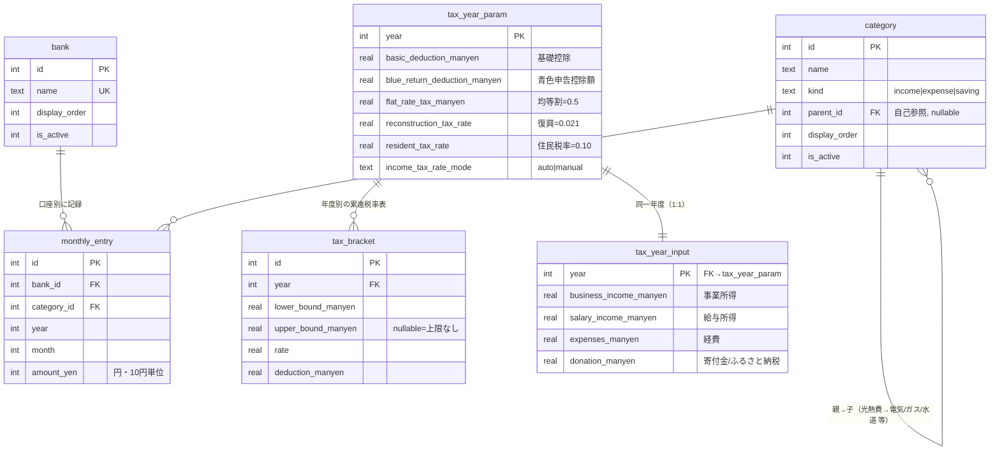

# データベーススキーマ設計（レビュー用ドラフト）

対象: [REQUIREMENTS.md](../REQUIREMENTS.md) §2（年度別パラメータ）・§3（生活費）・§4（税金算出）。
本書は**設計レビュー用**。DDL は SQLite 方言で記述するが、実装は同構造を SQLAlchemy 2.0 モデルで表現する。**この段階ではテーブル作成・マイグレーションは行わない。**

## 単位・型の規約（CLAUDE.md 準拠）
- **生活費（機能A）の金額 = 円・整数（`INTEGER`）**。10円単位。`monthly_entry.amount_yen`。
- **税金（機能B）の金額 = 万円・浮動小数（`REAL`）**。Excel を厳密再現するため万円 float で保持（列名サフィックス `_manyen`）。
- 日時は ISO8601 文字列（`TEXT`, `DEFAULT CURRENT_TIMESTAMP`）。
- 真偽は `INTEGER`(0/1)。

---

## 全体構成（ER 概要）



- **機能A（生活費）**: `bank` × `category` × 年月 の交差点が `monthly_entry`。`category` は自己参照で階層（例: 光熱費→電気/ガス/水道）を表現。
- **機能B（税金）**: 年度ごとに、マスタ（`tax_year_param` ＋ 子表 `tax_bracket`）と入力（`tax_year_input`）を分離。**マスタ＝法制度・手入力パラメータ、入力＝その年の申告値**。両者とも `year` をキーに 1:1 で対応。

---

## 機能A：生活費収支

### `bank`（銀行／口座）
```sql
CREATE TABLE bank (
    id            INTEGER PRIMARY KEY,
    name          TEXT    NOT NULL UNIQUE,          -- 楽天銀行 / 三井住友 / りそな / UFJ / 現金 等
    display_order INTEGER NOT NULL DEFAULT 0,
    is_active     INTEGER NOT NULL DEFAULT 1,
    created_at    TEXT    NOT NULL DEFAULT CURRENT_TIMESTAMP
);
```
- 現金支払い（Excelの「現金支払い」列）は `name='現金'` の擬似口座として持ち、`bank_id` を常に NOT NULL に保つ（NULL 混在による集計・一意制約の煩雑さを回避）。

### `category`（費目カテゴリ）
```sql
CREATE TABLE category (
    id            INTEGER PRIMARY KEY,
    name          TEXT    NOT NULL,
    kind          TEXT    NOT NULL DEFAULT 'expense'   -- 'income' | 'expense' | 'saving'
                          CHECK (kind IN ('income','expense','saving')),
    parent_id     INTEGER REFERENCES category(id) ON DELETE RESTRICT,  -- 階層グループ, NULL=最上位
    display_order INTEGER NOT NULL DEFAULT 0,
    is_active     INTEGER NOT NULL DEFAULT 1,
    created_at    TEXT    NOT NULL DEFAULT CURRENT_TIMESTAMP,
    UNIQUE (parent_id, name)
);
```
- `kind`:
  - `income` … 給与・その他収入（→ 収入総額）
  - `expense` … 食費・光熱費・保険・年金・返済・教育・小遣い 等（→ 支払総額）
  - `saving` … 税金貯金・積立（iDeco/NISA/小規模企業共済/税金貯金）。**余剰金の計算では支払（流出）側に含める**。
- 階層例（`parent_id`）: 光熱費 →（電気/ガス/水道）、保険 →（生命/国民健康保険/地震）。集計は葉ノードで持ち、親で合算表示。
- 同名カテゴリ（例: 各口座の「その他」）は親が異なれば許容するため `UNIQUE(parent_id, name)`。

### `monthly_entry`（月次エントリ）
```sql
CREATE TABLE monthly_entry (
    id          INTEGER PRIMARY KEY,
    bank_id     INTEGER NOT NULL REFERENCES bank(id)     ON DELETE RESTRICT,
    category_id INTEGER NOT NULL REFERENCES category(id) ON DELETE RESTRICT,
    year        INTEGER NOT NULL,
    month       INTEGER NOT NULL CHECK (month BETWEEN 1 AND 12),
    amount_yen  INTEGER NOT NULL DEFAULT 0
                        CHECK (amount_yen >= 0 AND amount_yen % 10 = 0),  -- 円・10円単位・非負
    note        TEXT,
    created_at  TEXT NOT NULL DEFAULT CURRENT_TIMESTAMP,
    updated_at  TEXT NOT NULL DEFAULT CURRENT_TIMESTAMP,
    UNIQUE (bank_id, category_id, year, month)
);
CREATE INDEX idx_entry_period   ON monthly_entry(year, month);
CREATE INDEX idx_entry_category ON monthly_entry(category_id);
CREATE INDEX idx_entry_bank     ON monthly_entry(bank_id);
```
- 金額は常に非負。収入／支払の別は `category.kind` で判定（符号を持たせない）。
- 集計（アプリ側で算出）:
  - 収入総額 = Σ(kind=income)、支払総額 = Σ(kind IN expense,saving)、**余剰金 = 収入総額 − 支払総額**。
  - 銀行別合計 = `GROUP BY bank_id`、年次サマリ = `GROUP BY year`。
- **税金貯金の連動**: 「毎月いくら貯金すべきか」は機能Bの税額分割（所得税÷5・住民税÷4・消費税÷5）から算出する派生値。専用テーブルは持たず、必要なら `saving`/「税金貯金」カテゴリの `monthly_entry` として書き込む。

---

## 機能B：税金算出（Excel を正とする）

### `tax_year_param`（税年度パラメータ＝年度別マスタ）
```sql
CREATE TABLE tax_year_param (
    year                          INTEGER PRIMARY KEY,     -- 2025, 2026, ...
    -- 所得控除の年度標準値（万円）
    basic_deduction_manyen        REAL NOT NULL DEFAULT 48,   -- 基礎控除（2025実績=58）
    blue_return_deduction_manyen  REAL NOT NULL DEFAULT 65,   -- 青色申告控除額（55/65/75）
    -- 固定・率パラメータ
    flat_rate_tax_manyen          REAL NOT NULL DEFAULT 0.5,  -- 市県民税(均等割) 5000円=0.5万
    reconstruction_tax_rate       REAL NOT NULL DEFAULT 0.021,-- 復興特別所得税率
    resident_tax_rate             REAL NOT NULL DEFAULT 0.10, -- 住民税率
    resident_tax_deduction_manyen REAL NOT NULL DEFAULT 0,    -- 住民税控除額(Excel S列)
    -- 所得税率: 累進表からの自動判定 or 年度手動上書き
    income_tax_rate_mode          TEXT NOT NULL DEFAULT 'auto'
                                  CHECK (income_tax_rate_mode IN ('auto','manual')),
    income_tax_rate_override      REAL,   -- manual時の税率(Excel N列, 例2025=0.20)
    income_tax_deduction_override REAL,   -- manual時の控除額(Excel O列, 例2025=60)
    -- 消費税・ふるさと納税の算定方式（切替可能に）
    consumption_tax_method        TEXT NOT NULL DEFAULT 'income_5pct'
                                  CHECK (consumption_tax_method IN ('income_5pct','invoice_2wari','none')),
    consumption_tax_rate          REAL NOT NULL DEFAULT 0.05, -- income_5pct時の率
    furusato_method               TEXT NOT NULL DEFAULT 'simple'
                                  CHECK (furusato_method IN ('simple','precise')),
    -- 税額の毎月分割数
    income_tax_split_count        INTEGER NOT NULL DEFAULT 5, -- 所得税÷5
    resident_tax_split_count      INTEGER NOT NULL DEFAULT 4, -- 住民税÷4
    consumption_tax_split_count   INTEGER NOT NULL DEFAULT 5, -- 消費税÷5
    created_at                    TEXT NOT NULL DEFAULT CURRENT_TIMESTAMP,
    updated_at                    TEXT NOT NULL DEFAULT CURRENT_TIMESTAMP
);
```
- **§5-1 の食い違い吸収**: `income_tax_rate_mode='auto'` は `tax_bracket` から課税所得で自動判定。`'manual'` は override 値を使用（2025 は税率0.20/控除60万を手入力 → 期待値89.54万を再現）。
- **§5-2/§5-3**: 消費税・ふるさと納税の算定方式を列挙で切替可能に。

### `tax_bracket`（累進税率テーブル・年度別）
```sql
CREATE TABLE tax_bracket (
    id                INTEGER PRIMARY KEY,
    year              INTEGER NOT NULL REFERENCES tax_year_param(year) ON DELETE CASCADE,
    lower_bound_manyen REAL   NOT NULL,        -- 区分下限（課税所得, 万円）
    upper_bound_manyen REAL,                   -- 区分上限, NULL=上限なし
    rate              REAL    NOT NULL,        -- 税率
    deduction_manyen  REAL    NOT NULL,        -- 控除額（万円）
    UNIQUE (year, lower_bound_manyen)
);
```
- 標準7区分（REQUIREMENTS.md §4）を年度ごとに seed。年度別に持つことで、法改正時の書き換えと「年度別編集」を両立。
- 判定: `lower_bound_manyen <= 課税所得 AND (upper_bound_manyen IS NULL OR 課税所得 <= upper_bound_manyen)`。

### `tax_year_input`（税年度入力＝その年の申告値）
```sql
CREATE TABLE tax_year_input (
    year                                 INTEGER PRIMARY KEY
                                         REFERENCES tax_year_param(year) ON DELETE CASCADE,
    -- 収入・経費（万円）
    business_income_manyen               REAL NOT NULL DEFAULT 0,  -- 事業所得(B)
    salary_income_manyen                 REAL NOT NULL DEFAULT 0,  -- 給与所得(C)
    salary_revenue_manyen                REAL,                     -- 給与収入(任意, §5-5将来: 給与所得控除で自動化)
    expenses_manyen                      REAL NOT NULL DEFAULT 0,  -- 経費(D)
    -- 各種所得控除（万円） ※基礎控除・青色は tax_year_param 側
    spouse_special_deduction_manyen      REAL NOT NULL DEFAULT 0,  -- 配偶者特別控除(F)
    life_insurance_deduction_manyen      REAL NOT NULL DEFAULT 0,  -- 生命保険料控除(G)
    social_insurance_deduction_manyen    REAL NOT NULL DEFAULT 0,  -- 社会保険控除(H)
    small_biz_mutual_aid_deduction_manyen REAL NOT NULL DEFAULT 0, -- 小規模企業共済等掛金控除(I)
    other_income_deduction_manyen        REAL NOT NULL DEFAULT 0,  -- その他所得控除(ラベルなし列J)
    earthquake_insurance_deduction_manyen REAL NOT NULL DEFAULT 0, -- 地震保険料控除(L)
    -- 寄付金
    donation_manyen                      REAL NOT NULL DEFAULT 0,  -- 寄付金/ふるさと納税(M)
    created_at                           TEXT NOT NULL DEFAULT CURRENT_TIMESTAMP,
    updated_at                           TEXT NOT NULL DEFAULT CURRENT_TIMESTAMP
);
```

#### この分割で Excel 数式が再現できることの確認（2025, 万円）
`core/tax.py`（純粋関数）が参照するソース:

| Excel | 本スキーマでの参照元 | 2025値 |
|---|---|---|
| 所得金額 `=B9+C9-D9-K9` | input.business + input.salary − input.expenses − **param.blue_return** | 975 |
| 課税所得 `=C7-SUM(E9:L9)+K9` | 所得 −(**param.basic** + input.spouse + input.life + input.social + input.small_biz + input.other + input.earthquake) | 747.7 |
| 所得税額 `=F7*N9-O9` | 課税所得 × 税率 − 控除（auto=bracket / manual=override） | 89.54 |
| 復興 `=O7*P9` | 所得税額 × param.reconstruction_tax_rate | 1.88 |
| 住民税 `=F7*R9-S9` | 課税所得 × param.resident_tax_rate − param.resident_tax_deduction | 74.77 |
| 市県民税 | param.flat_rate_tax | 0.5 |
| 消費税 `=C7*0.05` | 所得金額 × param.consumption_tax_rate（method分岐） | 48.75 |
| ふるさと上限 `=F7/10*0.2*10/7` | 課税所得 × 0.2 ÷ 7（furusato_method=simple） | 21.36 |
| 各種支払後残金 | 手取り − 社会 − 小規模 − その他 − 生命 − 地震 − 寄付金 | 566.46 |

- **青色申告控除は課税所得では差し引かない**（所得金額で控除済み。Excelの `+K9` に相当）。→ `param.blue_return` は所得金額の計算にのみ使用。
- **基礎控除・青色控除は年度マスタ**（`tax_year_param`）に置き、その年の申告値である**各種控除・収入・経費・寄付金は `tax_year_input`** に置く、という分担でユーザー指定の2表構成に一致。

---

## 将来拡張（今回は作成しない）
- `salary_income_deduction_bracket`（給与所得控除の年度別区分表, §5-5）… `salary_revenue_manyen` からの自動算出用。
- `app_setting`（バックアップ日時・表示単位設定 等）。
- 累進表・給与所得控除表・初期カテゴリ/銀行の **seed データ**（`data/masters/`）はスキーマ確定後に別途用意。

---

## テーブル一覧（サマリ）
| テーブル | 役割 | キー |
|---|---|---|
| `bank` | 口座マスタ | id / name |
| `category` | 費目カテゴリ（階層・income/expense/saving） | id / (parent_id,name) |
| `monthly_entry` | 銀行×カテゴリ×年月×金額（円） | (bank,category,year,month) |
| `tax_year_param` | 税年度パラメータ（基礎控除・青色・均等割・率・方式・分割数） | year |
| `tax_bracket` | 累進税率テーブル（年度別） | (year,lower_bound) |
| `tax_year_input` | 税年度入力（事業/給与/経費/各種控除/寄付金） | year |
